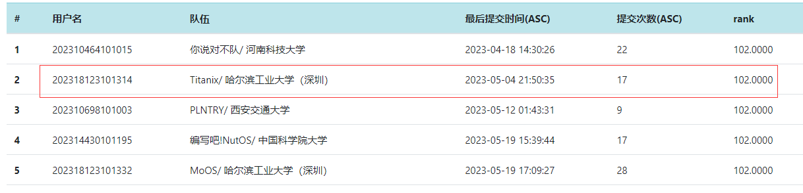
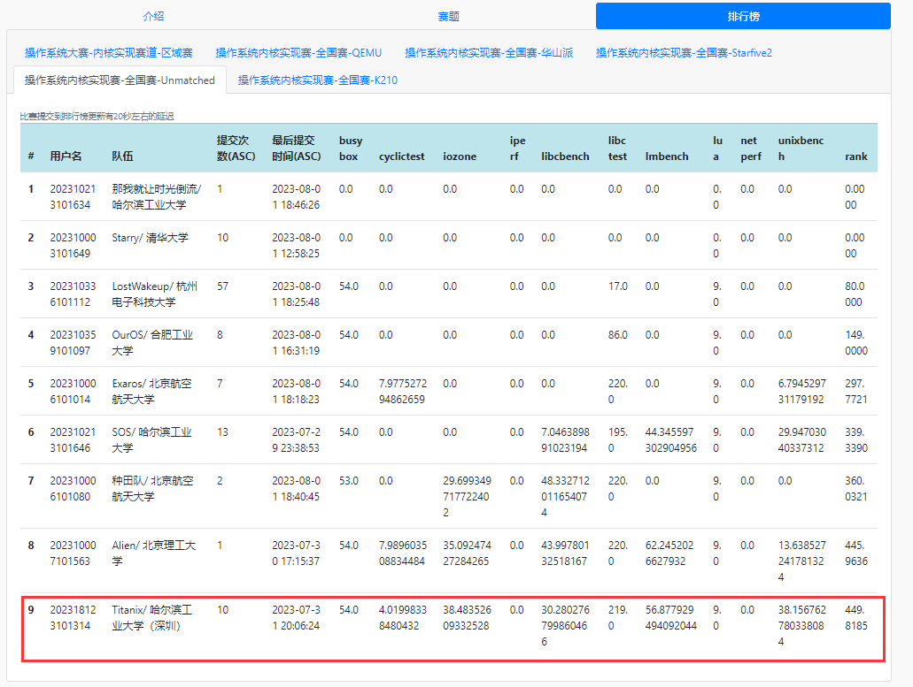

# Titanix


### 项目描述

使用Rust编写的，基于riscv64的支持多核的宏内核操作系统。

### 完成情况
<!-- 初赛满分
 -->

#### 决赛第一阶段

- Unmatched赛道，目前总分第一：



### Titanix内核介绍
- 进程管理：实现基本的进程与线程管理功能，支持libc的pthread库，能够通过比赛测试。支持动态链接。
- 内存管理：实现基本的内存管理功能。实现文件页缓存即匿名页映射。使用 懒分配 和 Copy_on_write 优化策略。
- 文件系统：完成虚拟文件系统。实现块缓存，支持dev文件系统。设计实现了FAT32文件系统，使用多种缓存机制提高文件系统速度。实现内存文件系统tmpfs以达到高速读写。
- 信号机制：完成基础的信号机制，支持用户自定义处理函数，能够通过比赛测试。
- 驱动：实现了SDCard驱动，可以直接读写SDCard上的测试用例。
- 用户程序：能够运行busybox、libc测试以及netperf等功能性测试，同时支持unixbench、lmbench等压力测试。

### 决赛第一阶段文档

决赛文档见项目根目录下的[决赛第一阶段文档.pdf](决赛第一阶段文档.pdf)

### 初赛文档

初赛文档见项目根目录下的[初赛文档.pdf](初赛文档.pdf)

### 代码架构简介
- bootloader: SBI
- os/src: 内核代码
  -  /boards: 开发板配置参数
  -  /config：内核的各个模块的相关配置参数
  -  /driver: 驱动
  -  /fs：文件系统
  -  /mm: 内存管理
  -  /net: 网络模块
  -  /process: 进程管理
  -  /processor: 多核心管理
  -  /syscall: 系统调用处理函数
  -  /trap: 异常处理
  -  /sync：同步机制
  -  /utils：工具数据结构
  -  main.rs: 主程序
  -  sbi.rs：sbi调用
  -  console.rs: 负责字符输入输出
  -  entry.asm：起始代码
- user: 用户程序


### 运行：

第一次运行需要先在/kernel目录下输入
```jax
sudo make fs-imag
```

在/kernel目录下输入

```jsx
make run
```

### 项目人员：

哈尔滨工业大学（深圳）：

- 曾培鑫(893522573@qq.com)：进程管理，内存管理，VFS设计，多核支持。
- 陈佳豪(Straho@163.com)：VFS设计，文件系统相关系统调用实现，设备驱动管理。
- 任秦江(1342330485@qq.com)：FAT32文件系统设计与实现。
- 指导老师：夏文，仇洁婷

### 参考：
- [FTL OS](https://gitlab.eduxiji.net/DarkAngelEX/oskernel2022-ftlos/-/tree/master/)
- [rCore-Tutorial v3](https://github.com/rcore-os/rCore-Tutorial-Book-v3)
- [Linux](https://github.com/torvalds/linux)
- [rCore](https://github.com/rcore-os/rCore)
- [jkxs-OS](https://gitlab.eduxiji.net/dh2zz/oskernel2022/-/tree/main)


### 感谢与声明：
本项目使用了洛佳等开发者的RustSBI，以及吴一凡等开发者的rCoreTutorial-v3。

同时感谢我们的学长叶自立，张艺枫，陈林锟，夏文老师和仇洁婷老师，以及同校参赛队伍的帮助。

本项目使用GPL3.0协议