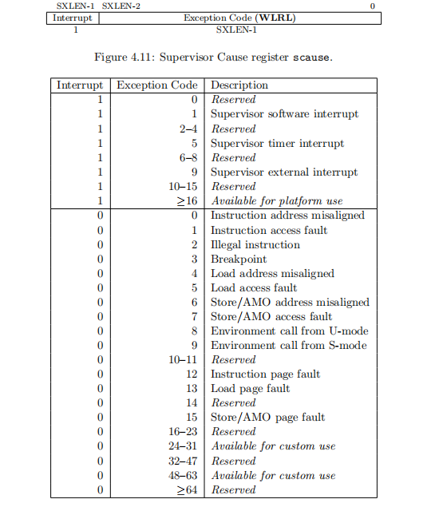
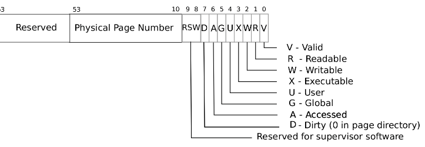
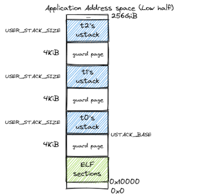
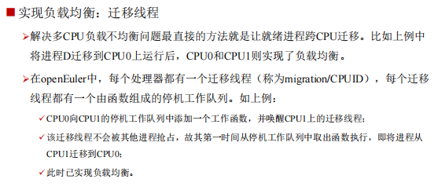

## RUST异步模型

- 常见库里的顶层执行器一般会基于OS相关的系统调用，如epool、kqueue等
- 拿到某个future的引用后执行await，后面可以再次调用await，会从上次执行点处继续执行

### RISCV

### Page Fault

- 目前Fork的时候cow时会直接挂上`CowPageFaultHandler`，后面实现懒加载elf时可能会冲突？

## 踩坑记录

- 修改页表后一定记得刷tlb！！！

## Linux的相关实现

### 进程/线程模型

- 统一用`task_struct`来表示，进程和线程的唯一区别是是否共享地址空间
- 内核线程没有自己的地址空间，因此当调度到内核线程的时候，他会用前一个进程的地址空间

### 地址空间

- 每个进程（线程）有一个`mm_struct`表示其拥有的地址空间；
- `mm_struct`管理一串`vm_area_struct`链表；
- 共享库的不可写区域可以被多个进程共用
- 内核通过`do_mmap`创建一个新的线性地址空间(`vm_area_struct`)，如果他跟相邻的vma的访问权限相同的话，可以合并，如果`file`参数为`NULL`的话，则为匿名映射

#### 用户栈地址空间

## 进程

### 线程调度

无栈协程架构

### 多核调度

模仿openEuler中的多核调度：

### exec参数传递

## 内存管理

### 页表

内核用户共用页表

### 地址空间

kernel space
BASE_ADDRESS = 0x80200000;
VIRTIO: `[0x10001000, 0x10002000]`
user space

### 内核线程

- 内核线程用的是内核全局页表

### COW

### Swap（？）

## 虚拟文件系统

### 主要数据类型

- Vfsmount对象：代表文件系统，可以不mount，和超级块一起使用
- 超级块对象：代表一个具体的已安装的文件系统
- 索引节点对象：代表一个具体文件，可以存储在磁盘上，拥有指向数据块的指针
- 目录项对象：一个目录项对应一个inode，该inode的data指针存储该目录项的数据
- 文件对象：代表进程打开的文件

### look_up实现

look_up实现查询给定文件目录下是否存在给定dentry当中对应的name的目录项，存在则返回。
其中：给定的文件目录通过inode来访问内容，返回值为dentry的引用。
注意，该函数不需要实现递归，递归由上层实现。

### unlink实现

unlink实现将Inode中存储的dentry对象的删除，由于我们目前没有实现硬链接功能，所以我们的在这里可以直接将对应的Inode给删除掉。

### mkdir无法实现

mkdir需要实现Inode和Dentry类型之间的相互添加，需要更改，要求两个类型都是可变的引用，目前不知道如何通过Arc实现。
如果使用可变引用，那么需要标注生命周期需要手动管理生命周期，不是明智之举。

### d_lookup实现

d_lookup是Dentry当中的一个方法，用于快速查找给定目录项下的子目录：
Although one could search the d_subdirs lists directly, this would be a slow process for large directories. Instead, d_lookup() hashes the parent directory's dentry pointer and the child's name, searching the global dentry_hashtable for the corresponding dentry. 

这里的DCACHE就相当于一个存储了指向各个Dentry的指针，要求DCACHE不能死亡，常驻内存。这样Dentry也不会自动死亡，常驻内存，形成Dcache。

## FAT32文件系统