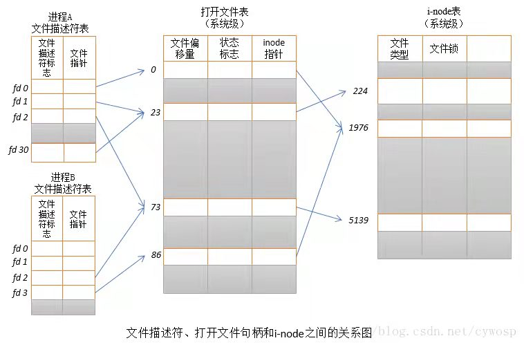

# FS

## VFS

- 对于/dev这种内存文件系统，是否可以只将dev这个目录项放到inode cache里呢？

## 打开文件表

## 块缓存与页缓存

- 一个缓存的页可能被划分不同的块缓存，从而在更细的粒度下，识别出页被修改的部分
- 一个页的具体数据可能来自某段内存空间，也可能来自块缓存
- PageCache结构体即为linux内核中`address_space`，维护了一段内存空间