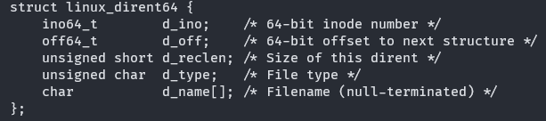

# chdir

更改当前进程的工作目录，需要先对传入的用户空间的参数进行check，如果可以读取，再进行传入的工作目录的合法性判断，包括：
1. 判断长度是否过长
2. 判断指定工作目录是否存在
如果合法，那么更改当前目录的cwd

dup: 队长已实现

# fstat

This syscall return the file state information to user memory space through given pointer.

The file discriptor and user space pointer should be given.

should copy the structure kstat to user memory.

```
struct kstat {
	dev_t st_dev;
	ino_t st_ino;
	mode_t st_mode;
	nlink_t st_nlink;
	uid_t st_uid;
	gid_t st_gid;
	dev_t st_rdev;
	unsigned long __pad;
	off_t st_size;
	blksize_t st_blksize;
	int __pad2;
	blkcnt_t st_blocks;
	long st_atime_sec;
	long st_atime_nsec;
	long st_mtime_sec;
	long st_mtime_nsec;
	long st_ctime_sec;
	long st_ctime_nsec;
	unsigned __unused[2];
}

All the time should be updated in syscall, not in Inode function. Because this will be easier.

```
test file:
printf("fstat: dev: %d, inode: %d, mode: %d, nlink: %d, size: %d, atime: %d, mtime: %d, ctime: %d\n",
	      kst.st_dev, kst.st_ino, kst.st_mode, kst.st_nlink, kst.st_size, kst.st_atime_sec, kst.st_mtime_sec, kst.st_ctime_sec);

# getcwd

需要返回当前进程的工作目录（cwd），需要对传入的用户态的内存空间进行check，可以写入之后将cwd拷贝到用户空间的指定位置

已经通过

# getdents

比赛官方要求实现getdents64的系统调用，该dirent的结构是特殊的，不是vfs需要实现的dentry，是需要返回给用户的dirent，因此：
我们需要在用户空间和内核空间中都定义dirent的结构体，包含以下成员：


该系统调用实现将传入的fd对应的file下面的inode的所有孩子inode的部分信息返回到指定的用户空间的内存当中，并返回拷贝的长度。

已经通过

# mkdir

This system call will create a new inode for the new directory, and write to disk. Besides, it will create "." directory and ".." directory to connect with the parent directory.

EEXIST pathname already exists (not necessarily as a directory). This includes the case where pathname is a symbolic link, dangling or not.

已通过

# mount

*需要更改UserCheck，目前不能实现不带大小的check*

在Linux中，mount系统调用需要以下参数：

第一个参数是要挂载的文件系统的设备名称或特殊标识符，例如/dev/sda1。

第二个参数是指定挂载点的路径，也就是将文件系统挂载到哪个目录下。

第三个参数是指定文件系统类型，通常是一个字符串，例如ext4、ntfs等等。

第四个参数是用于控制文件系统挂载的一些选项，例如读写权限、是否允许执行等等。

最后一个参数是一个可选的用于传递特定选项的结构体指针，例如在NFS挂载时可以使用这个参数来指定NFS的版本号和超时时间等信息。

在 Linux 内核中，mount 系统调用是用于将指定文件系统挂载到指定的挂载点上，其主要实现分为两部分：

## VFS 层处理

当用户进程调用 mount 函数时，内核中的 VFS 层会负责解析用户传入的参数，并调用对应文件系统类型的 mount 函数进行挂载操作。具体来说，VFS 层会完成以下几个步骤：

通过用户传入的设备名或者文件路径等信息，获取目标文件系统的超级块对象；

从文件系统类型列表中找到对应文件系统类型的 mount 函数，并将超级块对象和一些其他参数传递给该函数；

在指定挂载点下创建一个新的挂载点对象（mount point），并设置该对象的相关属性，包括文件系统类型、超级块对象、挂载标志等；
将新的挂载点对象加入到 VFS 中的挂载点链表中，完成挂载操作。

## 文件系统类型处理

每种文件系统类型都需要提供独立的 mount 函数实现，用于具体的文件系统挂载操作。这些函数通常定义在各自的 .c 文件中，例如 ext4 文件系统的 mount 函数实现可在 fs/ext4/super.c 文件中找到。

文件系统的 mount 函数会接收到 VFS 层传递过来的一些参数，包括：

目标文件系统的超级块对象；

挂载点对象的相关信息，包括挂载标志、文件系统类型、上一级目录的 dentry 对象等。

## 文件系统的 mount 函数通常需要完成以下几个步骤：

检查目标设备或者文件是否可访问，并在需要时对其进行打开操作；

解析目标文件系统的超级块对象，确定文件系统相关的参数，例如磁盘块大小、inode 节点大小等；

为该文件系统创建一个新的超级块对象，并初始化其中的相关字段；

创建相应的根目录 dentry 对象，并将其与超级块对象相关联；

根据需要将其它对象添加到 VFS 中，并更新相关内容；

返回挂载点对象，表示成功挂载文件系统。

openat: 队长已实现

pipe: 队长已实现

read: 队长已实现

umount:

# uname

This system call is used to get the name and some information about current kernel.

已经通过

# unlink

delete a name and possibly the file it refers to.

在实现上，当调用unlink()函数并传递要删除的文件的路径时，内核会执行以下操作：

首先，内核会检查当前进程是否具有足够的权限来删除该文件。如果没有，则unlink()函数将返回一个错误。由于Rusty OS没有对权限进行设计，所以我们可以直接删除。

接下来，内核会搜索文件系统以查找要删除的文件，并从文件系统元数据（如inode表）中获取有关文件的信息。如果文件不存在，则unlink()函数将返回一个错误。

如果文件存在并且进程拥有相应的权限，则内核会标记该文件的inode为“已删除”，并从文件系统目录中删除对该文件的引用。此时还是没有真正被删除，而是标记要删除，并且从inode cache当中删除。

最后，如果没有任何其他进程打开该文件并且没有进行任何更改，则内核将释放该文件占用的所有磁盘空间。

需要注意的是，由于unlink()系统调用仅将文件标记为已删除而不是立即删除文件，因此其他进程仍然可以访问该文件的内容，直到所有进程关闭该文件描述符并释放它占用的所有资源。

需要注意所有权的问题，由于rust当中的ARC可以让没有引用的对象直接被free掉，所以我们只需要在内存的inode cache中将对应的inode删除，然后当所有进程都不使用之后，该对象就会直接被free掉；

同时，我们还需要将磁盘上的inode删除。由于当前已经获得inode的ARC引用的进程使用的都是inode cache当中的inode，所以，我们可以在删除的时候立刻调用对应的接口，让实际文件系统直接删除对应的inode。这不会影响已经获取到对应inode的进程的读写。

write: 队长已实现