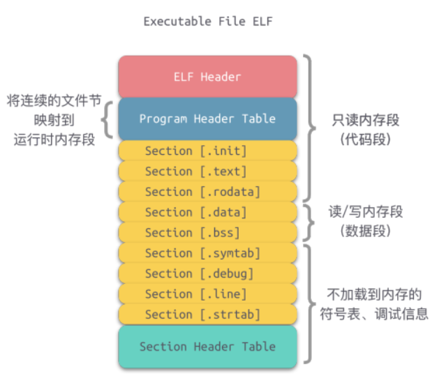
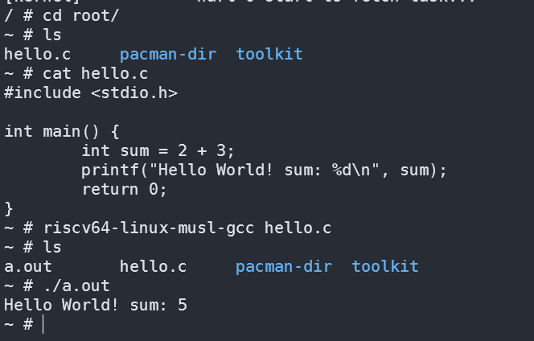

### gcc编译过程中一直到调用as汇编器时会段错误退出？

- elf文件格式:

- exec初始化进程栈时auxv中有个AT_PHDR的对象，这个东西填的时候elf中的段表的地址，如图所示，其地址就在代码段中，因此我们在加载elf的时候会把第一个映射上的段（即代码段）的起始地址加上段表的文件偏移量即是AT_PHDR;
- 发现as汇编器的第一个段的起始地址是0x0，而我们在获取AT_PHDR的时候默认直接跳过0的段，导致PHDR被赋值为第二个段加上段表的文件偏移量，出现了错误

### 成果

