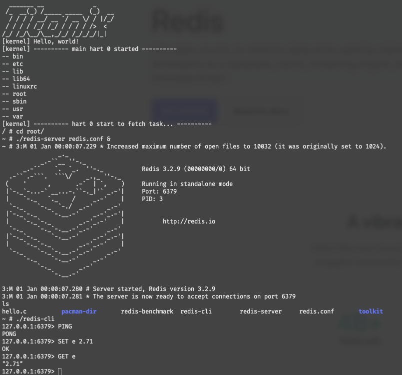
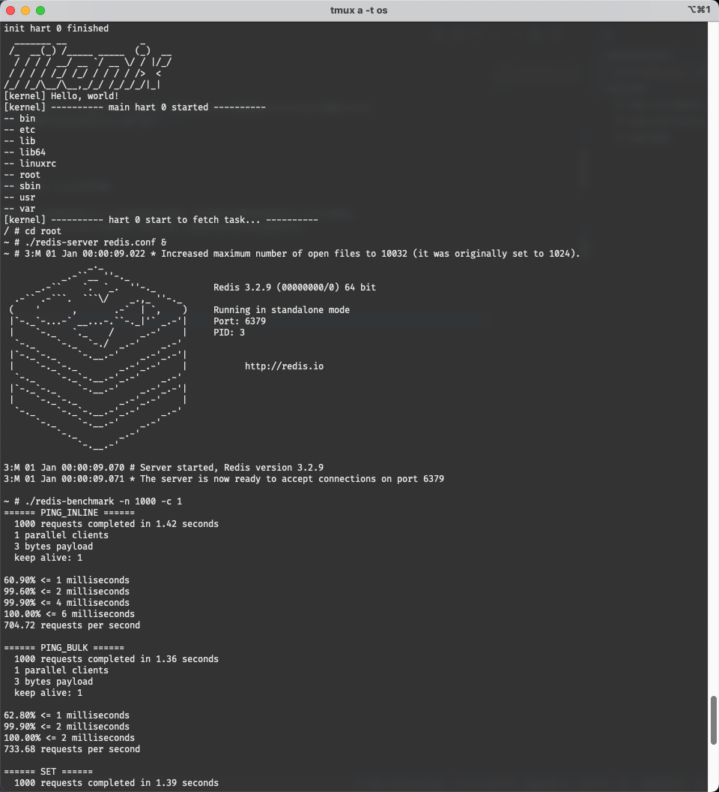
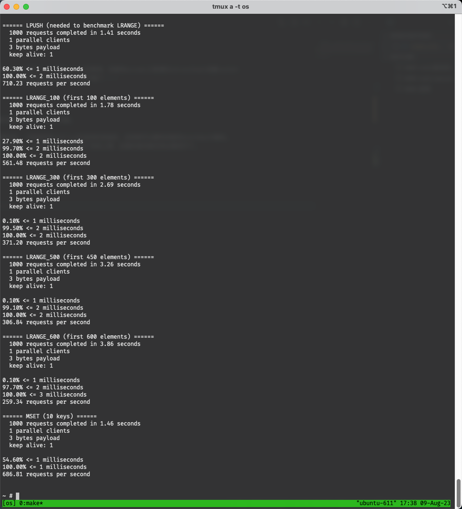

### redis测试时会卡死

查看syscall发现server在第一次创建socket之后收到client的connect之后accept一次，但是立马又创建新的socket进行listen和accept的等待，但是在accept之前通过setsockopt设置socket
为非阻塞状态，所以在第二个socket accept的时候会返回一个EAGAIN表示资源暂时不可用，只需要实现了非阻塞accept就可以成功启动redis客户端了！！！

### redis benchmark 提前abort

在测试benchmark的时候会在跑SET的测试的时候提前退出，但是如果多输出一些TCP的日志就可能顺利跑完，该问题可能是TCP close的问题。

发现是因为之前tcp设置了延迟以保证对于所有数据都可以完全发送到对端之后才返回，但是现在更改成只对大数据设置时延，小数据按照smoltcp的返回时刻返回，这样就可以顺利的跑完benchmark测试。
我们猜测这是因为banchmark的测试对单个tcp的测试时间有限制，如果在指定时间内没有跑完指定数量的额tcp就会自动退出，redis会认为测试到了系统上限，后面的测试就没有必要进行了。

### 成果

