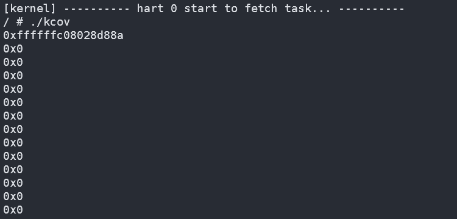

我们对kcov相关的文档进行了调研，将[kcov: code coverage for fuzzing](https://www.kernel.org/doc/html/v4.14/dev-tools/kcov.html)中的测试代码在riscv平台上进行静态编译，并移入我们的Titanix；以下是kcov的测试代码：

```
#include <stdio.h>
#include <stddef.h>
#include <stdint.h>
#include <stdlib.h>
#include <sys/types.h>
#include <sys/stat.h>
#include <sys/ioctl.h>
#include <sys/mman.h>
#include <unistd.h>
#include <fcntl.h>

#define KCOV_INIT_TRACE                     _IOR('c', 1, unsigned long)
#define KCOV_ENABLE                 _IO('c', 100)
#define KCOV_DISABLE                        _IO('c', 101)
#define COVER_SIZE                  (64<<10)

int main(int argc, char **argv)
{
    int fd;
    unsigned long *cover, n, i;

    /* A single fd descriptor allows coverage collection on a single
     * thread.
     */
    fd = open("/sys/kernel/debug/kcov", O_RDWR);
    if (fd == -1)
            perror("open"), exit(1);
    /* Setup trace mode and trace size. */
    if (ioctl(fd, KCOV_INIT_TRACE, COVER_SIZE))
            perror("ioctl"), exit(1);
    /* Mmap buffer shared between kernel- and user-space. */
    cover = (unsigned long*)mmap(NULL, COVER_SIZE * sizeof(unsigned long),
                                 PROT_READ | PROT_WRITE, MAP_SHARED, fd, 0);
    if ((void*)cover == MAP_FAILED)
            perror("mmap"), exit(1);
    /* Enable coverage collection on the current thread. */
    if (ioctl(fd, KCOV_ENABLE, 0))
            perror("ioctl"), exit(1);
    /* Reset coverage from the tail of the ioctl() call. */
    __atomic_store_n(&cover[0], 0, __ATOMIC_RELAXED);
    /* That's the target syscal call. */
    read(-1, NULL, 0);
    /* Read number of PCs collected. */
    n = __atomic_load_n(&cover[0], __ATOMIC_RELAXED);
    for (i = 0; i < n; i++)
            printf("0x%lx\n", cover[i + 1]);
    /* Disable coverage collection for the current thread. After this call
     * coverage can be enabled for a different thread.
     */
    if (ioctl(fd, KCOV_DISABLE, 0))
            perror("ioctl"), exit(1);
    /* Free resources. */
    if (munmap(cover, COVER_SIZE * sizeof(unsigned long)))
            perror("munmap"), exit(1);
    if (close(fd))
            perror("close"), exit(1);
    return 0;
}
```

此后，我们对Titanix中使用的函数进行了手动的插桩，并编写/sys/kernel/debug/kcov路径对应的解析调用，运行Titanix并通过```./kcov```运行测试。结果如下，有点小问题，但总体是没问题的：
